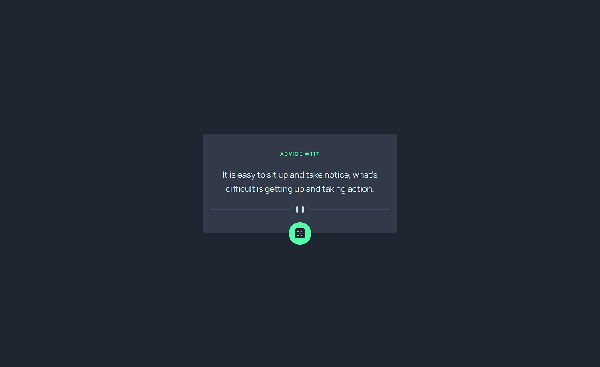

<h2 align="left">Advice generator - application gives random advice fetching from the API</h2>
<h3 align='left'>About project 🔍</h3> 

Solution of frontend mentor challenge. The application generates advices taken from the API.

💻 Link to the challenge: https://www.frontendmentor.io/challenges/advice-generator-app-QdUG-13db

<h2 align='left'>Technologies used 💎</h2> 

React 🔹 Typescript 🔹 Styled components 🔹 API

